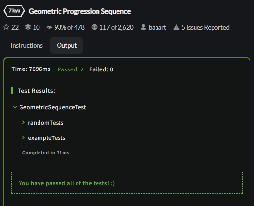

<p align = "center">МИНИСТЕРСТВО НАУКИ И ВЫСШЕГО ОБРАЗОВАНИЯ
РОССИЙСКОЙ ФЕДЕРАЦИИ
ФЕДЕРАЛЬНОЕ ГОСУДАРСТВЕННОЕ БЮДЖЕТНОЕ
ОБРАЗОВАТЕЛЬНОЕ УЧРЕЖДЕНИЕ ВЫСШЕГО ОБРАЗОВАНИЯ
«САХАЛИНСКИЙ ГОСУДАРСТВЕННЫЙ УНИВЕРСИТЕТ»</p>
<br><br><br><br><br><br>
<p align = "center">Институт естественных наук и техносферной безопасности<br>Кафедра информатики<br>Хроменков Владимир Александрович</p>
<br><br><br>

<p align = "center">Лабораторная работа №5<br>«Вторая activity»<br>01.03.02 Прикладная математика и информатика</p>

<p align = "center">Лабораторная работа №4<br>«Отладка Android-приложений»<br>01.03.02 Прикладная математика и информатика</p>
<br><br><br><br><br><br><br><br><br><br><br><br>
<p align = "right">Научный руководитель<br>
Соболев Евгений Игоревич</p>
<br><br><br>
<p align = "center">г. Южно-Сахалинск<br>2023 г.</p>

***
# <p align = "center">Оглавление</p>
- [Цели и задачи](#цели-и-задачи)
- [Решение задач](#решение-задач)
    - [Упражнение. Вывод версии Android на устройстве](#api)
    - [Упражнение. Ограничение подсказок](#count_cheat)
    - [CodeWars](#codewars)
- [Вывод](#вывод)

***

# <p align = "center">Цели и задачи</p>

1.  Добавьте в макет GeoQuiz виджет TextView для вывода уровня API устройства, на котором работает программа. На рисунке показано, как должен выглядеть результат.
<p align = "center">
    
</p>
Результат упражнения Задать текст TextView в макете не получится, потому что версия операционной системы устройства не известна до момента выполнения. Найдите функцию TextView для задания текста в справочной странице TextView в документации Android. Вам нужна функция, получающая один аргумент — строку (или CharSequence). Для настройки размера и гарнитуры текста используйте атрибуты XML, перечисленные в описании TextView.
 
2.	Ограничьте пользователя тремя подсказками. Храните информацию о том, сколько раз пользователь подсматривал ответ, и выводите количество оставшихся подсказок под кнопкой. Если ни одной подсказки не осталось, то кнопка получения подсказки блокируется.

3. CodeWars
 - [Profile CodeWars](https://www.codewars.com/users/ZFGinc)
 - [Alphabet war](https://www.codewars.com/kata/59377c53e66267c8f6000027)
 - [The 'spiraling' box](https://www.codewars.com/kata/63b84f54693cb10065687ae5)
 - [Count the Digit](https://www.codewars.com/kata/566fc12495810954b1000030)
 - [Fix string case](https://www.codewars.com/kata/5b180e9fedaa564a7000009a)
 - [Geometric Progression Sequence](https://www.codewars.com/kata/55caef80d691f65cb6000040)
 - [Sum of odd numbers](https://www.codewars.com/kata/55fd2d567d94ac3bc9000064)


***

# <p align = "center">Решение задач</p>

## <p align = "center">Упражнение. Вывод версии Android на устройстве</p>

Добавил через `XML` разметку `TextView` для отображения версии `API Android`.
Через код запрашиваю текущую версию и вывожу её.

```kotlin
version_api.setText("API Level "+Build.VERSION.SDK_INT.toString());
```

Так же проверил её на разных устройствах, дабы убедиться в работоспособности

<p align = "center">
    
    
</p>


## <p align = "center">Упражнение. Ограничение подсказок</p>

Для начала изменил класс `QuizViewModel.kt` - добавил константу для определения максимального количества подсказок и функцию, которая возвращает оставшееся количество подсказок.

```kotlin
package com.zfginc.geoquize

import androidx.lifecycle.ViewModel

private const val MAX_USE_CHEAT = 3;

class QuizViewModel: ViewModel() {
    ...

    val lastCountCheat: Int
        get() = if(countCheatAnswered() > 3) 0 else (MAX_USE_CHEAT-countCheatAnswered())

    fun countCheatAnswered() : Int {
        var count : Int = 0;
        for(quest in questionBank){
            if(quest.isCheating == true) count++;
        }

        return count;
    }

    ...
}
```

Далее в `MainActivity.kt` добавил связь с текстом под кнопкой, который так же был добавлен заранее. В самом начале вывожу количество оставшихся подсказок.

```kotlin
count_cheat.setText(quizViewModel.lastCountCheat.toString())
```

Так же вызываю эту строку после выбора ответа, который был выбран с помощью подсказки и проверяю, если подсказок не осталось.

```kotlin
private fun writeAnswer(answer : Boolean){
    quizViewModel.setAnswer(answer);

+++ var lastCount = quizViewModel.lastCountCheat
+++ count_cheat.setText(lastCount.toString())

+++ if(lastCount == 0) cheat_button.isClickable = false;

    if(quizViewModel.isCheater){
        showToast(R.string.judgment_toast);
    }
}
```

<p align = "center">
    
    
</p>


## <p align = "center">CodeWars</p>

### [Alphabet war](https://www.codewars.com/kata/59377c53e66267c8f6000027)
```kotlin
fun alphabetWar(fight: String): String {
	var score = 0

    for (letter in fight) {
		if (letter == 'w') score -= 4
		if (letter == 'p') score -= 3
		if (letter == 'b') score -= 2
		if (letter == 's') score -= 1
		if (letter == 'm') score += 4
		if (letter == 'q') score += 3
		if (letter == 'd') score += 2
		if (letter == 'z') score += 1
	}

    if (score < 0) return "Left side wins!"
    else if (score > 0) return  "Right side wins!"
    else return "Let's fight again!"
}
```
<p align = "center">
    
</p>

### [The 'spiraling' box](https://www.codewars.com/kata/63b84f54693cb10065687ae5)
```kotlin
fun createBox(width: Int, length: Int): Array<IntArray> {
    val array = Array(length) { IntArray(width) }

    for (row in 0 until length) {
        for (col in 0 until width) {
            array[row][col] = minOf(row, col, width - col - 1, length - row - 1) + 1
        }
    }
    return array
}
```
<p align = "center">
    
</p>

### [Count the Digit](https://www.codewars.com/kata/566fc12495810954b1000030)
```kotlin
package countdig

fun nbDig(n:Int, d:Int):Int {
    var num:Int 
    var res =0    
   
    for (i in 0..n){
        num = i*i
        while (num!=0) {
          if (num%10==d)
          res++
          num/=10;
        }        
    }
    if (d==0) {
        res++
    }
    return res
}
```
<p align = "center">
    
</p>

### [Fix string case](https://www.codewars.com/kata/5b180e9fedaa564a7000009a)
```kotlin
object FixStringCase {
    fun solve(s: String): String{
        if (s.count { it.isUpperCase() } > s.length / 2) return s.toUpperCase() 
        else return s.toLowerCase()

    }
}
```
<p align = "center">
    
</p>

### [Geometric Progression Sequence](https://www.codewars.com/kata/55caef80d691f65cb6000040)
```kotlin
fun geometricSequenceElements(a: Int, r: Int, n: Int): String {
    var str = a.toString()
    var c = a
    for(i in 2..n){
        c = c*r
        str += ", "+c.toString()
    } 
    return str
}
```
<p align = "center">
    
</p>

### [Sum of odd numbers](https://www.codewars.com/kata/55fd2d567d94ac3bc9000064)
```kotlin
fun rowSumOddNumbers(n: Int): Int = n*n*n
```
<p align = "center">
    
</p>

***

# <p align = "center">Вывод</p>

Выполнив *лабораторную работу №6*, совершенствую навыки работы со средой разработки `Android Studion` и работы с языком `Kotlin`. 